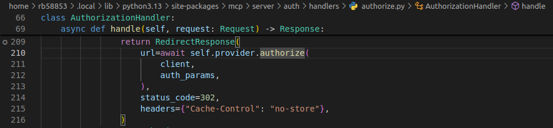

### `/autorize` endpoint

Este endpoint lo que hace s redirigir hacia el metodo [`provider.autorize`](../src/mcp_oauth/server/auth_provider/simple_auth_provider.py) y todo el control del request es parte del autorize del sdk de python. Este metodo acepta tanto `"POST"` como `"GET"`, siempre se le debe pasar el client_id y el state. Para meor comprension leease el codigo fuente.

Este es el metodo llamado desde el [_default_redirect_handler](../src/mcp_oauth/client/features/callbacks.py) del cliente para abrir una url.

### Others
